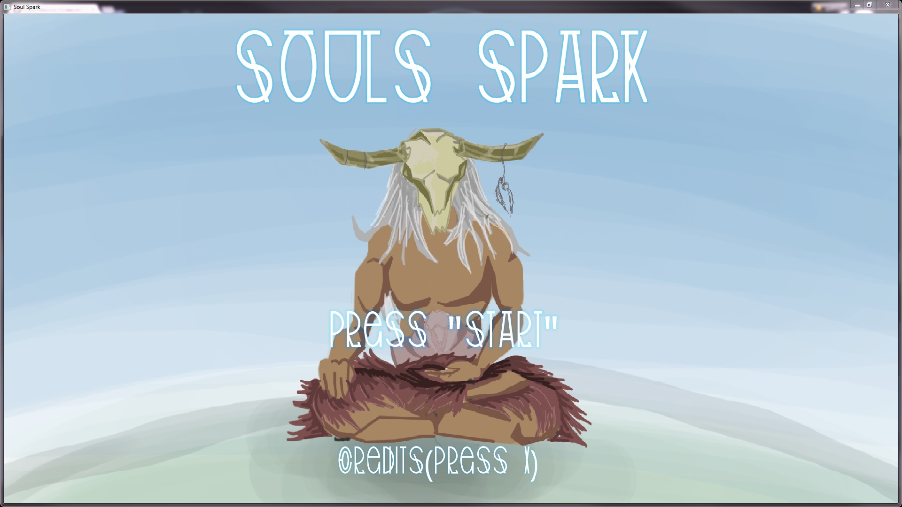
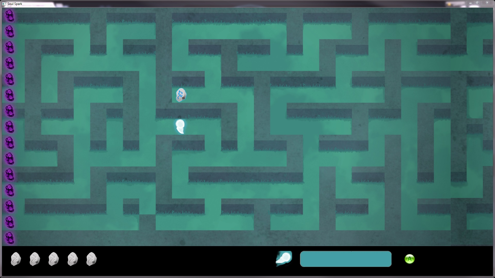
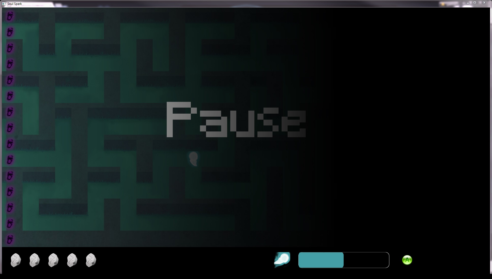
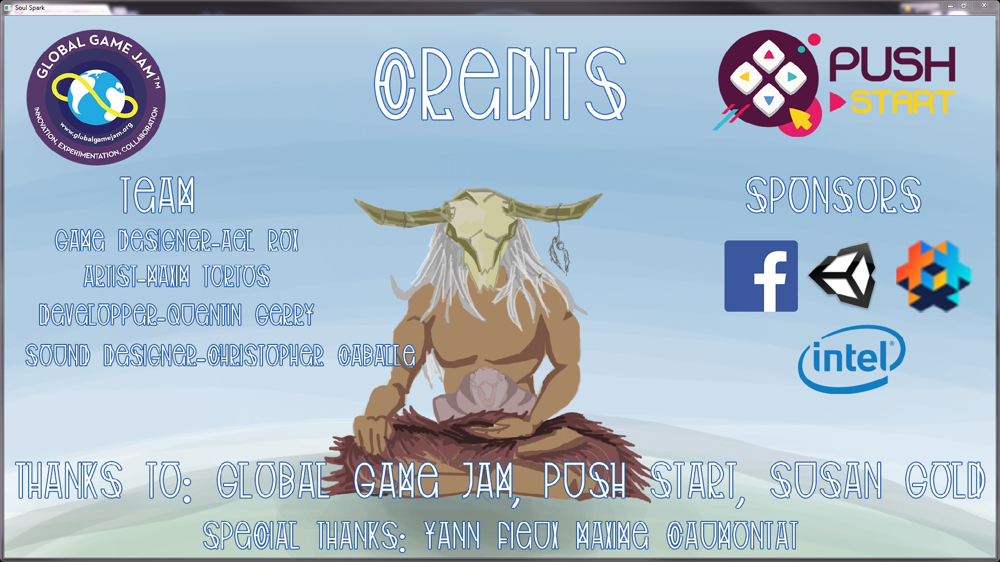

# Soul Spark

The Soul Spark is the ritual which, every 100 years, the shaman has to accomplish to escape from death. His soul has to gather pieces of other souls through a maze before death reaches for it.

<b>Game Website:</b>   
https://www.facebook.com/soulsparkggj

#Credits:   
<b>Game Designer:</b> Aël Rox  
<b>Artist:</b> Maxim Tortos  
<b>Developper:</b> Quentin Gerry  
<b>Sound Designer:</b> Christopher Caballe  

<b>Sponsors:</b> Unity, Intel, Facebook, Defold  

<b>Thanks to:</b> Global Game Jam, Push Start, Susan Gold

<b>Special thanks:</b>  
Yann Fieux  
Maxime Caumontat  

#Gallery

